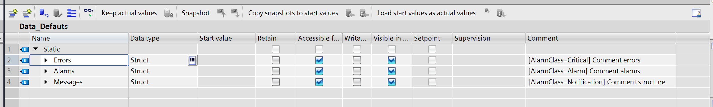

# TIA Alarms unified
Add-on extract all comments from global database ended by "_Defaut" and build HMI unified alarms with class alarms and origin.
This add-on is compatible with TIA V18 and V19 for standalone or multiuser projects
# Usage
- Declare PLC-HMI Connection.
- Build all databases message for HMI alarms.
- When start add-on from contextal menu (database or folder), the add-on genere hmi tag, hmi alarm and affect class alarm if struct as tag **[AlarmClass=*"ClassName"*]** or structure name is class alarm name. Origin Fiel is database name.
# Installation of TIA add-in
1. Install simatic TIA portal V18 or upper, make sure openness is checked.
2. Right clik "My computer" -> Manage -> System tools -> Local users and groups -> Groups -> Double click “Siemens TIA Openness” and add your username.
3. Install Add-Ins by copying the ".addin" file into the "AddIns" folder in the installation directory of the TIA Portal.
4. Activate or deactivate Add-Ins in the "Add-Ins" task card (Add-Ins are deactivated by default).
5. Further information on the Add-In such as the author, description or the required authorizations are also displayed in the "Add-Ins" task card. 
# License
tia_Extract is licensed under the MIT license. See the LICENSE file for more information.